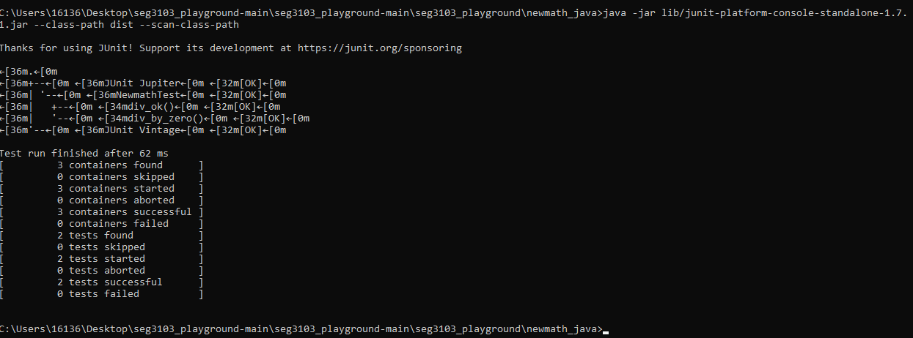

# Lab 01

Edited by Charie Brady, 300043672

| Outline | Value |
| --- | --- |
| Course | SEG 3103 |
| Date | Summer 2021 |
| Professor | Andrew Forward, aforward@uottawa.ca |
| TA | zkaka044@uottawa.ca |
| Team | Andrew Forward 1484511 Ayana Forward 9021000 |

## Deliverables

* [https://github.com/aforward/seg3103_playground/tree/main/lab01](https://github.com/aforward/seg3103_playground/tree/main/lab01)
* Shared repo above with TA and Professors

### Java

Version: 

Example of running Main.java in cmd: 

### JUnit

Version: JUnit 5 platform console standalone 1.7.1

Example of running test in cmd:

### Elixir

Version: 

Example of running mix.exs in cmd: 

### ExUnit

ExUnit included with Elixir. 

Example of running test in cmd:

